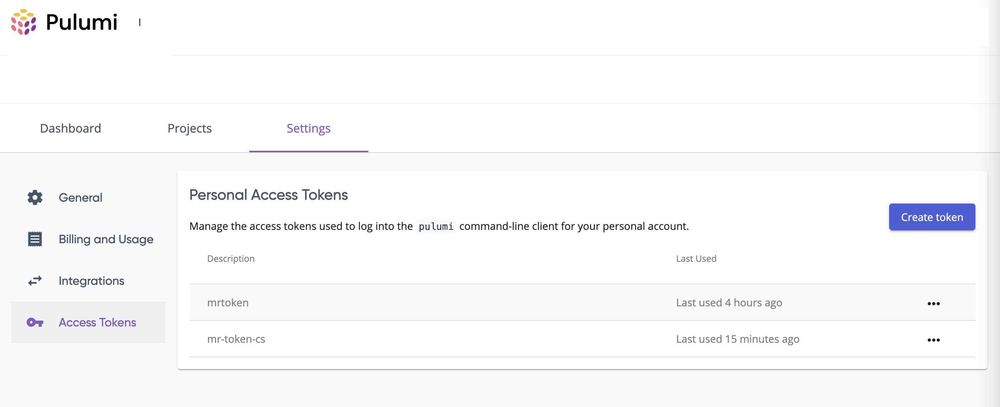
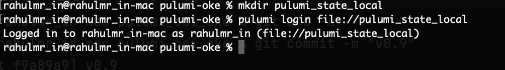
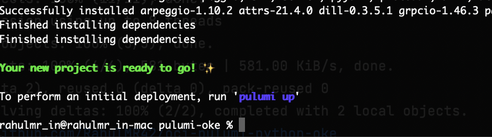
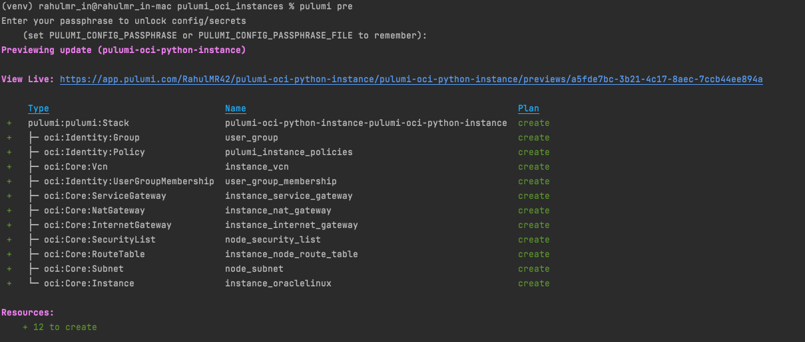
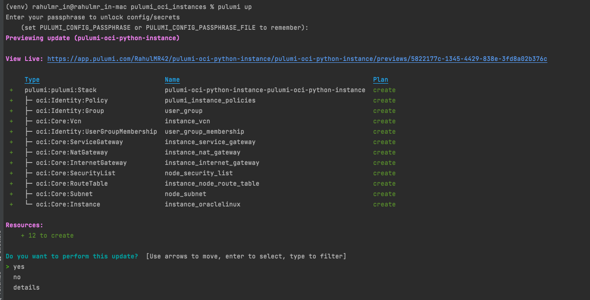
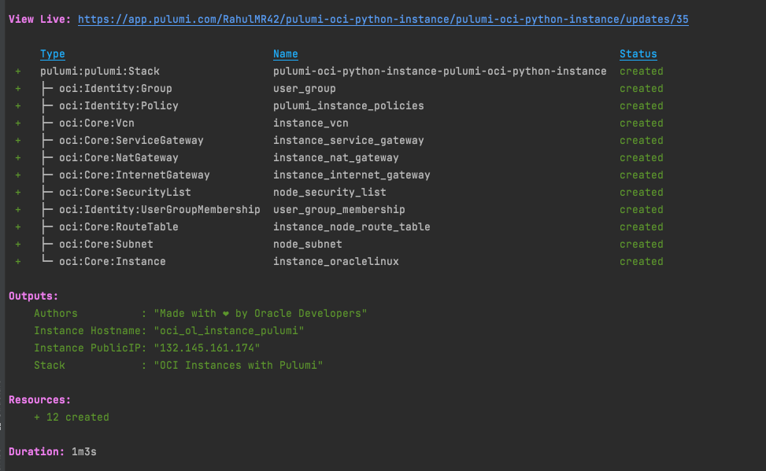
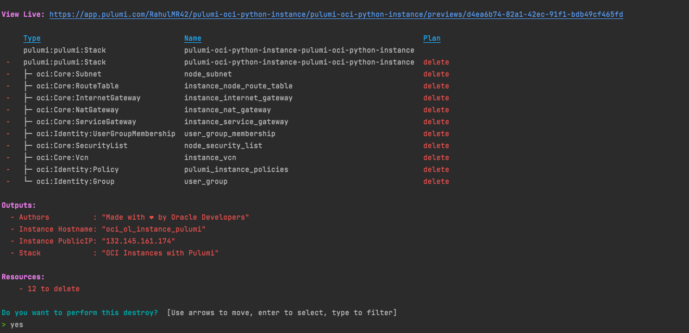

OCI Pulumi Instances  - With Python.
------

[](https://img.shields.io/badge/license-UPL-green) [](https://sonarcloud.io/dashboard?id=oracle-devrel_pulumi-python-oci-instances)

This is an OCI Pulumi python code that deploys [Compute VM instance](https://docs.oracle.com/en-us/iaas/Content/Compute/home.htm) on [Oracle Cloud Infrastructure (OCI)](https://cloud.oracle.com/en_US/cloud-infrastructure).

## About
Oracle Cloud Infrastructure Compute lets you provision and manage compute hosts, known as instances . You can create instances as needed to meet your compute and application requirements. After you create an instance, you can access it securely from your computer, restart it, attach and detach volumes, and terminate it when you're done with it. Any changes made to the instance's local drives are lost when you terminate it. Any saved changes to volumes attached to the instance are retained.

## Prerequisites
1. Download and install Pulumi CLI - https://www.pulumi.com/docs/get-started/install/
2. If not installed , download and install Python3 (3.7 or later) - https://www.python.org/downloads/
3. Oracle crdentials for Pulumi - https://www.pulumi.com/registry/packages/oci/installation-configuration/

## Optional Prerequisites

- You can manage pulumi stack with stage-managed by pulumi itself , to do so create an account on Pulumi via - https://app.pulumi.com/
- In the below procedure we will be explaining steps where the state is managed by Pulumi or with a local file.

## How to deploy

- Validate the execution of Pulumi CLI - `pulumi version`
- Validate the python3 execution - `python -V`
- Create a folder for the code and switch into it.
```markdown
$ mkdir oci-pulumi-instance
$ cd oci-pulumi-instance
```
- Login to pulumi
  - If you wish to have the infra states managed by Pulumi use `pulumi login` and follow the instruction.
  - You can create a personal access token via the URL and copy it back to the pulumi login prompt as well.



- If you wish to manage the states locally follow below
```markdown

$ mkdir pulumi-state-local
$ pulumi login file://pulumi-state-local
```



- Create a new pulumi stack - `pulumi new https://github.com/oracle-devrel/pulumi-python-oci-instances ` --force
- Do not need to use `--force ` for login with Pulumi managed infra state mode.
- When prompted use `pulumi-oci-python-instance` as the project name and use the default description.
- Provide the stack name as `pulumi-oci-python-instance`
- You may enter or keep an empty passphrase when asked for the config.
  

- You may also refer to the files using `ls -ltr` commands.
- Let's preview the stack using `pulumi preview`.
- It will list all the components to create but with debugging errors, as expected.
  

- Debug errors are due to the fact the OCI credentials are not yet set up.
- Set below   the environment variables Or with Secret configs - https://www.pulumi.com/registry/packages/oci/installation-configuration/

- As ENV values.

```markdown
export TF_VAR_tenancy_ocid="ocid1.tenancy.oc1..<unique_ID>"
export TF_VAR_user_ocid="ocid1.user.ocX..<unique_ID>"
export TF_VAR_fingerprint="<key_fingerprint>"
export TF_VAR_region=<OCI Region>
export TF_VAR_private_key_file="/path/to/oci_api_key.pem"
```

- As encrypted secrets (Within pulumi config control/Not with OCI Vault)

```markdown
pulumi config set oci:tenancyOcid "ocid1.tenancy.oc1..<unique_ID>" --secret
pulumi config set oci:userOcid "ocid1.user.oc1..<unique_ID>" --secret
pulumi config set oci:fingerprint "<key_fingerprint>" --secret
pulumi config set oci:region "us-ashburn-1"
# Set the private key from standard input to retain the format
cat "PATH TO PEMFILE " | pulumi config set oci:privateKey --secret
```

- Set compartment_ocid and SSH Public key  as a config value.
```markdown
pulumi config set compartment_ocid "OCID of your compartment"
pulumi config set path_ssh_pubkey "<Path to SSH Public key>" 
```
- You may verify the values of your stack using the file `Pulumi.pulumi-oci-python-instance.yaml`
- Re-run preview and validate the configuration `pulumi preview`
- Create the infra using `pulumi up`, use the arrow key and provide the confirmation.



- You may see the infra is getting created.



- Once completed, validate the resources /access the resources via the OCI console

- Delete the stack using `pulumi destroy `



- Optionally , Delete stack files - `pulumi stack rm pulumi-oci-python-oke`
- Logout from pulumi `pulumi logout`

## Read more

- https://www.pulumi.com/registry/packages/oci/installation-configuration/

## Contributors
Author: Rahul M R.
Collaborators: NA
Last release: June 2022

## Contributing
This project is open source.  Please submit your contributions by forking this repository and submitting a pull request!  Oracle appreciates any contributions that are made by the open-source community.

## License
Copyright (c) 2024 Oracle and/or its affiliates.

Licensed under the Universal Permissive License (UPL), Version 1.0.

See [LICENSE](LICENSE) for more details.

ORACLE AND ITS AFFILIATES DO NOT PROVIDE ANY WARRANTY WHATSOEVER, EXPRESS OR IMPLIED, FOR ANY SOFTWARE, MATERIAL OR CONTENT OF ANY KIND CONTAINED OR PRODUCED WITHIN THIS REPOSITORY, AND IN PARTICULAR SPECIFICALLY DISCLAIM ANY AND ALL IMPLIED WARRANTIES OF TITLE, NON-INFRINGEMENT, MERCHANTABILITY, AND FITNESS FOR A PARTICULAR PURPOSE.  FURTHERMORE, ORACLE AND ITS AFFILIATES DO NOT REPRESENT THAT ANY CUSTOMARY SECURITY REVIEW HAS BEEN PERFORMED WITH RESPECT TO ANY SOFTWARE, MATERIAL OR CONTENT CONTAINED OR PRODUCED WITHIN THIS REPOSITORY. IN ADDITION, AND WITHOUT LIMITING THE FOREGOING, THIRD PARTIES MAY HAVE POSTED SOFTWARE, MATERIAL OR CONTENT TO THIS REPOSITORY WITHOUT ANY REVIEW. USE AT YOUR OWN RISK. 


 
